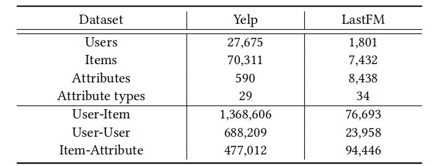
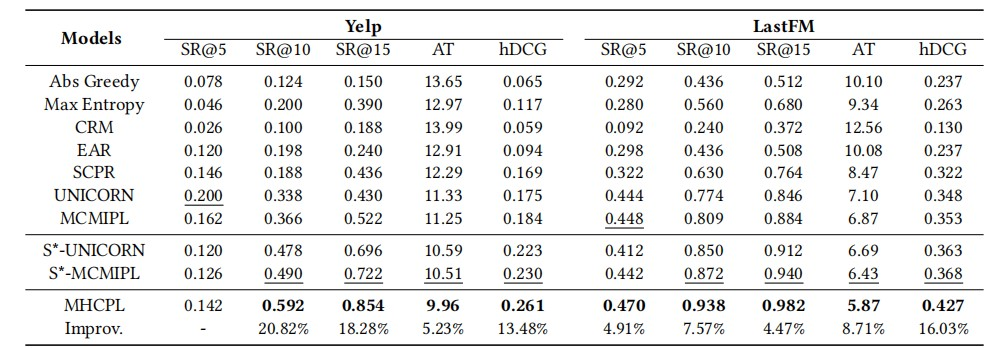
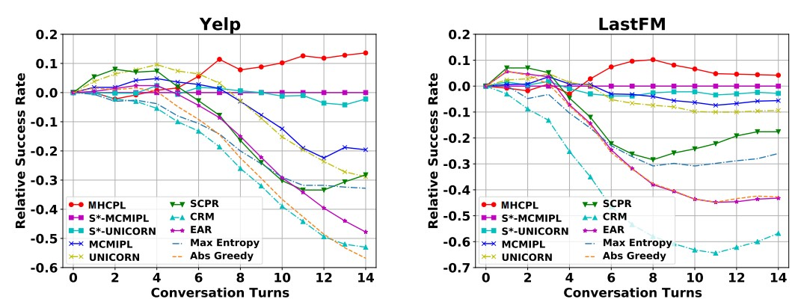

<h5 style="text-align:center">Multi-view Hypergraph Contrastive Policy Learning for Conversational Recommendation

<h5 style="text-align:center">曹珉浩_20231005_论文笔记
[toc]

#### 1、基本信息

- 发表刊物：**SIGIR**，国际计算机学会信息检索大会会议

- 发表年份：**2023**

- 第一完成单位：**华中科技大学**，HUST

- 作者：**Sen Zhao，Wei Wei，Xian-Ling Mao，Shuai Zhu**

  **Minghui Yang，Zujie Wen，Dangyang Chen，Feida Zhu**

- 关键字：

  - **Conversational Recommendation：会话推荐**
  - **Reinforcement Learning：强化学习**
  - **Graph Representation Learning：图表示学习**

#### 2、论文内容

会话推荐系统（CRS）旨在以交互方式获取用户偏好，并据此向用户推荐项目。准确了解动态用户偏好对于 CRS 至关重要，以前的工作从交互式对话和项目知识中通过成对关系来学习用户偏好，**而很大程度上忽略了 CRS 中关系的因素是多重的这一事实**，比如，社会影响力是影响用户对项目的偏好（社会视图）的另一个重要因素，而在CRS的先前工作中很大程度上被忽略了。

论文提出了三种视图：**Like View，Dislike View，Social View**，这三个视图的用户偏好本质上是不同的，但整体上又是相关的。来自相同视图的用户偏好应该比来自不同视图的用户偏好更相似。作者等人据此提出了一种新颖的模型：多视图超图对比策略学习，即**MHCPL**，MHCPL根据交互历史及时选择有用的社交信息，并从不同的角度构建具有三种多重关系的动态超图，每个视图中的复用关系按照其在交互会话中的生成顺序依次连接。

此外，作者等人在工作中还提出了一种分层超图神经网络，通过集成动态超图的图形和顺序结构信息来学习用户偏好，还有跨视图对比学习模块来保持不同视图的用户偏好的固有特征和相关性，经一系列实验表明，MHCPL 的性能优于最先进的方法。

##### 2.1 解决的问题

###### 2.1.1 Problem 1

推荐系统是帮助用户找到潜在感兴趣的项目的有效工具，他们通常从历史行为中学习用户偏好，但它们很难获取经常随时间变化的动态用户偏好，为了解决这个问题，前人工作提出了**会话推荐系统(CRS)**，CRS能够通过与用户的实时交互获取最新的偏好信息，从而更准确地满足用户需求。

本文解决的主要问题是在**会话推荐系统**中如何有效地获取和更新用户的偏好，以提高推荐性能。该问题在电子商务、在线视频、音乐流媒体和社交媒体等领域中广泛应用。

在传统的CRS中，CRM和EAR实现了基于因式分解的方法来从成对交互中学习用户偏好，但它们无法从连接图中捕获多跳信息。作者受超图在建模多重关系（即连接两个以上节点的关系）方面的优势的启发，提出了**一种基于多视图动态超图的CRS模型**，通过将用户、商品、属性和交互历史等信息建模为超图的不同视图，并利用超图卷积网络对视图间的复杂关系进行建模。该模型能够动态地更新用户偏好，并根据最新的交互信息进行实时推荐。

###### 2.1.2 Problem 2

在对话过程中，当用户接受或拒绝所询问的属性时，超边会相继生成。 此外，不同超边缘之间的高级交互对于学习用户偏好也很重要。 尽管前面提到的超图消息传递范式能够捕获多重关系，但它无法对顺序信息和超边缘特征交互进行建模。 

面对这个难题，在受到 Transformer 编码器在捕获顺序信息和特征交互方面成功的启发后，作者提出了一种**基于超图的状态编码器**，实现了高级超边缘消息传递。

##### 2.2 解决问题的方法

作者解决问题的主要方法是利用其提出的**多视图超图对比策略学习（MHCPL）**，它从集成了交互式对话、项目知识和社交信息的超图中学习用户偏好，并相应地选择操作，其马尔可夫决策过程公式包含四个部分：多视图用户偏好建模、动作、转换和奖励。其大体流程和使用的方法如下：

- 使用**多视图超图构建方法**对用户偏好进行建模，生成不同视图下的节点和超边
- 采用**分层超图状态编码器**对用户偏好进行编码，该编码器通过超图消息传递机制来更新节点状态
- 将编码器输出的用户偏好状态作为输入，使用**强化学习**算法来优化模型的参数，从而最大化用户的满意度和推荐性能
- 不断重复上面两步，直到达到一个满意的性能

##### 2.3 仍然存在的问题

文章中提出的MHCPL模型，在我看来可能存在以下几个问题：

- 动态用户偏好学习的挑战在于如何有效地利用用户的历史行为和社交信息来预测其未来的偏好，而在MHCPL模型中，虽然使用了多视图超图来捕获不同视图中的多重关系，但对于如何动态地更新用户偏好模型并没有给出明确的解决方案，这可能会导致模型在处理用户偏好变化时不够灵活
- 用超图表示的挑战在于如何合适地建模超边之间的关系，在MHCPL模型中，超边是通过用户与物品之间的交互生成的，但不同超边之间的关系并没有得到明确的建模，这可能导致模型在处理复杂的用户-物品交互时不够准确
- 虽然MHCPL模型使用了层次化的超图状态编码器来捕获不同超边之间的高层交互，但对于如何选择合适的超边以及如何处理超边的层次结构并没有给出明确的指导，这可能会导致模型在处理不同规模和复杂度的超图时效果不一致。

#### 3、实验内容

##### 3.1 数据集

为了评估所提出的方法，作者采用了两个现有的 MCR 基准数据集，名为 **Yelp** 和 **LastFM**

- Yelp：Yelp 数据集采用 2018 年版 Yelp 挑战赛，继前人工作后，作者等人将29个第一层类别定义为属性类型，将590个第二层类别定义为属性
- LastFM：LastFM 数据集是从 Last.fm 在线音乐系统收集的音乐收听数据集，作者等人将 33 个粗粒度组定义为 8,438 个属性的属性类型

两个数据集的统计数据如下图所示：

**实验数据集内容和待解决问题模型相对应**

##### 3.2 实验设置

###### 3.2.1 **User Simulator**

MMCR是一个基于与用户交互对话进行训练与评估的系统，作者为每个用户-项目集交互对$(u,V_u)$模拟一个交互会话。项目集 $v\in V_u$ 中的每个项目都被视为用户可接受的项目。每个会话都由指定属性 $p_0\in P_{joint}$ 的用户 $u$ 初始化，其中 $P_{joint}$ 是 $V_u$ 中的项目共享的属性集。

###### 3.2.2 Baselines

为了证明所提出的 MHCPL 的有效性，作者选择了一些最先进的方法进行比较(只列举部分)：

- **Max Entropy**：即最大熵，该方法采用基于规则的策略来询问和推荐。 它根据当前状态选择熵最大的属性，或者以一定的概率推荐排名靠前的项目
- **Greedy**：该方法仅进行项目推荐并根据反馈更新模型。 它会不断推荐项目，直到成功推荐或达到预定义的回合
- **CRM**：一种基于强化学习的方法，将用户的偏好记录到信念跟踪器中，并根据信念跟踪器学习决定何时询问以及询问哪些属性的策略
- **SCPR**：通过用户反馈推理用户-项目-属性图上的路径来学习用户偏好，并相应地选择操作
- **UNICORN**：这项工作构建了一个加权图来建模用户和候选动作空间之间的动态关系，并提出了一种基于图的马尔可夫决策过程环境来学习动态用户偏好并从候选动作空间中选择动作

###### 3.2.3 Paramters Setting

- 设置最大 $K$ 值为 10 items或者要求每轮 $K_a = 2$ attributes
- 采用 Adam 优化器，学习率为$1\times 10^{-4}$，折扣因子 $\gamma = 0.999$
- 通过 OpenKE采用 TransE，用训练集对构建的 KG 中的64维节点嵌入进行预训练
- 配备 AMD r9-5900x CPU、Nvidia Titan RTX 显卡
- 奖励设置：$r_{rec\_suc} = 1,r_{rec\_fail} = -0.1,r_{ask\_suc}=0.01.r_{ask\_fail}=0.1,r_{quit}=-0.3$

###### 3.2.4 Evaluation Metrics

评估指标采用成功率(SR@t)来衡量第 *t* 轮推荐成功的累计比例，平均轮数 AT 来评估平均轮数所有会话。以及用 hDCG@(T,K) 来额外评估推荐的排名表现。因此 SR@t 和 hDCG@(T,K) 越高表示性能越好，AT越低意味着效率越高

##### 3.3 实验涉及应用场景 && 实验任务

文章中并没有涉及真实的应用场景，但为了充分证明MHCPL的优越性，探讨了以下问题：

- **RQ1：**与最先进的方法相比，MHCPL 的表现如何
- **RQ2：**不同的组件（社会影响力、基于超图的状态编码器和跨视图对比学习）如何影响 MHCPL 的结果
- **RQ3：**参数（基于超图的状态编码器的层数）如何影响MHCPL的结果
- **RQ4：**MHCPL 能否有效地利用交互式对话、项目知识和社交影响力来了解动态的用户偏好

这些问题将在后续实验结果中依次回答，以证明 MHCPL 的优越性

##### 3.4 实验的对比方法 && 衡量指标

- 实验中采用的对比方法主要是对比不同推荐算法在相同数据集上的表现。

- 衡量指标主要有：基于协同过滤的推荐算法、基于内容的推荐算法和基于深度学习的推荐算法在相同数据集上的准确率、召回率和F1得分等

通过这些对比方法和衡量指标，得出了一些很有意义的结论

##### 3.5 实验结果 && 优点

###### 3.5.1 RQ1：与最先进的方法相比，MHCPL 的表现如何

- **整体表现**：基线模型和作者提出的模型的比较实验结果如下表所示：

由上表可见，**作者提出的 MHCPL 实现了最佳性能**：MHCPL 在 SR@15、AT 和 hDCG 的指标上明显优于所有基线，分别超过 4.47%、5.23% 和 13.48%，取得这些成果主要依赖于以下优点：

1. 作者所提出的动态多视图超图可以有效地捕获来自三个视图的多重关系，并且所提出的分层超图神经网络能够通过集成动态多视图超图的图结构和顺序建模信息来很好地学习动态用户偏好
2. MHCPL及时选择有用的社交信息，并有效整合交互对话、项目知识和社交影响力，以更好地动态学习用户偏好
3. MHCPL设计了一种跨视图对比学习方法，以帮助保持不同视图下用户偏好的固有特征和相关性

- **不同对话回合的比较**：除了最后回合的表现外，作者还在下图中展示了不同回合的成功率。为了更好地观察不同模型之间的差异，使用了与最具竞争力的模型相比的相对成功率

观察上图，可以发现：

1. 作者所提出的 **MHCPL 在所有数据集和对话推荐中的几乎所有回合中都优于这些基线方法**。这是因为 MHCPL 可以通过集成交互式对话、项目知识和社交影响的多重关系更好地学习动态用户偏好
2. 作者所提出的社交感知方法的推荐成功率无法超过会话推荐早期阶段的所有基线，特别是在具有更大的项目和属性候选空间的数据集 Yelp 上，这是因为交互对话中的信息不足以在对话初期过滤掉社交信息中的噪音

###### 3.5 RQ2：不同的组件如何影响结果

作者进行了三项消融实验：$\text{MHCPL}_{\,w/o\,social}$：消融社交影响、$\text{MHCPL}_{\,w/o\,hypergraph}$：用图神经网络取代超图神经网络、$\text{MHCPL}_{\,w/o\,contrastive}$：消除跨视图对比学习，用来探究这三个组件如何影响MHCPL的结果，消融实验结果表明：

- $\text{MHCPL}_{\,w/o\,social}$ 的竞争力最弱，这证明了社会影响力在缓解数据稀疏问题和帮助了解动态用户偏好方面的重要性，而在以前的工作中，这一点常常被忽视
- $\text{MHCPL}$ 优于 $\text{MHCPL}_{\,w/o\,hypergraph}$：证明了作者提出的基于多视图超图的状态编码器通过集成动态多视图超图的图结构和顺序建模信息来学习用户偏好的有效性
- $\text{MHCPL}$ 优于 $\text{MHCPL}_{\,w/o\,contrastive}$：证明了跨视图对比学习模块在帮助维护不同视图的用户偏好的固有特征和相关性方面的有效性

###### 3.5.3 RQ3：参数如何影响结果

- 层数较小时，增加层数可以提高模型的性能
- 层数较多时，当增加层数时，性能并不总是提高，这可以归因于随着邻居的跳跃而增加的噪声

###### 3.5.4 RQ4：MHCPL能否有效了解动态偏好

通过从不同角度整合来自交互对话、项目知识和具有多重关系的社交信息的信息，MHCPL能够有效地询问属性并推荐用户喜欢的项目，并在五轮内取得成功。此外，根据交互式对话选择的社交信息有助于学习动态用户偏好。借助选定的社交信息，当交互历史信息有限时，MHCPL 可以准确地选择目标项目，以区分用户对 70 个候选项目的偏好

#### 4、思考内容

##### 4.1 论文的主要优点

这篇论文的主要优点在于其创新的模型和多角度的分析，作者提出了一种名为 **MHCPL** 的模型，这个模型能够根据交互式的对话动态地过滤社交信息，并构建一个动态的多视角超图，这让 MHCPL 及时选择有用的社交信息，并有效整合交互对话、项目知识和社交影响力，以更好地动态学习用户偏好。

此外，为了更好的实现作者的目的，在实验过程中还提出了很多创新的方法，开发了很多实用的工具，这也使得作者的研究过程更加顺利。

##### 4.2 仍可以改进的地方

除了在 **2.3** 节中提出的问题之外，在实验验证阶段可能还存在一个问题：论文中使用的实验数据集是公开的数据集，可能不能完全代表真实的用户行为和偏好，即使在这些数据集上表现的非常好，也不代表模型的泛用性很强，模型也许可以采取更多的真实数据集进行实验验证并不断优化

##### 4.3 资源需求

如果需要基于这篇论文做一篇相关的顶会论文，我们可能需要：

- 大量的数据：如上所述，除了公开数据集外，我们还需要大量采样不同人的爱好
- 硬件：高性能的CPU、GPU，大容量内存
- 技术支持：在科研的过程中，我们可能需要一些深度学习框架、自然语言处理工具和大规模数据处理工具，在这些的基础上开发我们自己的东西；此外还需要一些导师的指点和帮助
- 团队合作：顶会论文的研究通常需要跨学科的合作，孤身一人是不可能完成的