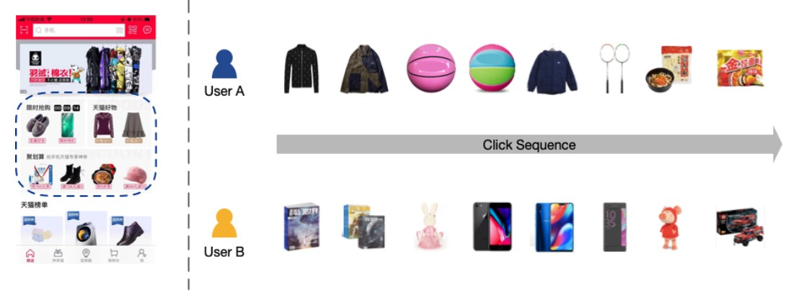
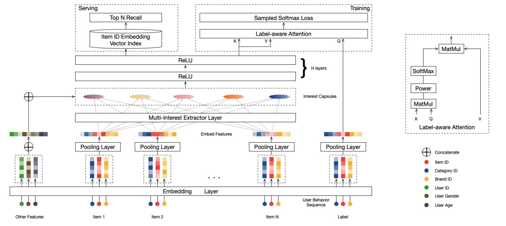
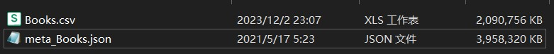
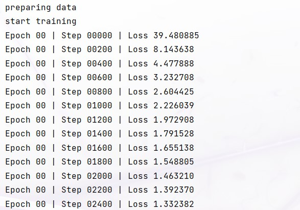
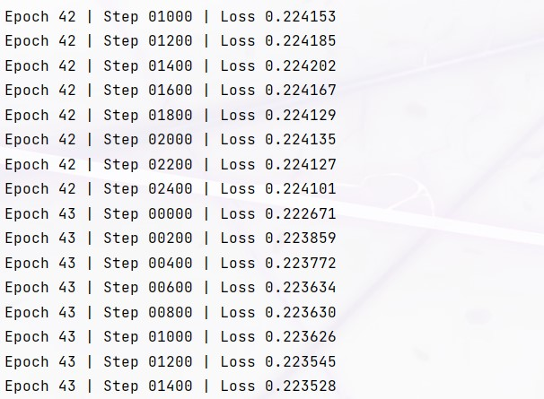
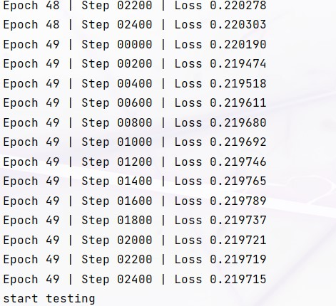
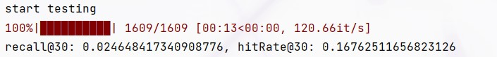
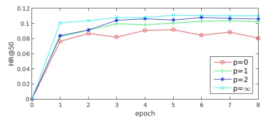

<h3 style="text-align:center"> 信息检索实验报告 hw6

<h4 style="text-align:right"> 姓名：曹珉浩   学号：2113619

[toc]

#### 一、背景与意义

工业推荐系统通常由匹配阶段和排名阶段组成，以处理数十亿规模的用户和商品。 匹配阶段检索与用户兴趣相关的候选项目，而排名阶段则根据用户兴趣对候选项目进行排序。 因此，**最关键的能力是对任一阶段的用户兴趣进行建模和表示**。 大多数现有的基于深度学习的模型**将一个用户表示为单个向量，这不足以捕获用户兴趣的不同性质**。在本次作业中，我们查阅了若干论文，并决定复现**多兴趣网络模型MIND**，即**用多个编码用户兴趣不同方面的向量来表示一个用户**，采用**动态路由**机制，能够捕捉用户兴趣的动态变化并试图提高推荐的准确性。在作者论文的结果展示中我们也可以看到，该网络在离线评估中取得了较好的效果，并通过案例研究进一步验证了其有效性。

#### 二、现状分析

天猫是中国最大的企业对客户（B2C）电子商务平台，通过在线提供数十亿级产品，服务于数十亿级用户。 每年的11月11日是著名的天猫全球购物节，商品交易总额（GMV）约为两千多亿元。 在产品不断增长的今天，帮助每个用户找到他/她可能感兴趣的产品变得越来越重要。近年来，天猫大力开发个性化推荐系统（简称RS），为用户体验的优化和商业价值的提升做出了巨大贡献。 例如，占天猫总流量一半左右的手机天猫App首页（如下图所示）就部署了RS来展示个性化产品，满足客户的个性化需求。



天猫拥有数十亿规模的用户和商品，其推荐流程分为两个阶段：**匹配阶段和排名阶段**。 匹配阶段负责检索数千个与用户兴趣相关的候选项目，然后排名阶段预测用户与这些候选项目交互的精确概率。 对于这两个阶段，对用户兴趣进行建模并找到捕获用户兴趣的用户表示至关重要，以支持有效检索满足用户兴趣的项目。 然而，由于用户存在不同的兴趣，在天猫对用户兴趣进行建模并非易事。 平均有数十亿规模的用户访问天猫，每个用户每天与数百种产品进行交互。 交互的产品往往属于不同的类别，表明用户兴趣的多样性。 例如上图所示，不同的用户的兴趣是不同的，同一用户也可能对多种项目感兴趣。 因此，捕捉用户多样化兴趣的能力对于天猫RS来说至关重要。

然而，**现有的推荐算法以不同的方式建模和表示用户兴趣**。 前人基于协同过滤的方法通过**历史交互**项或**隐藏因素**来表示用户兴趣，这些方法**存在稀疏问题或计算要求高**。 **基于深度学习的方法通常用低维嵌入向量来表示用户兴趣**。 例如，为YouTube视频推荐提出的深度神经网络（YouTube DNN）通过一个从用户过去的行为转换而来的固定长度向量来表示每个用户，这可能成为建模不同兴趣的瓶颈，因为它的维度必须为了表达天猫海量的兴趣档案。 **深度兴趣网络（DIN）通过注意机制使用户表示在不同项目上有所不同，以捕获用户兴趣的多样性。** 然而，**注意力机制的采用也使得它对于具有十亿级项目的大规模应用程序来说在计算上难以实现，因为它需要重新计算每个项目的用户表示，使得 DIN 仅适用于排名阶段，而在匹配阶段表现平庸**。

为了解决这个问题，我国学者提出了**MIND**，用于学习反映工业RS匹配阶段用户不同兴趣的用户表示。比较新颖的是，论文实现了一个称为**多兴趣提取器层**的新颖层，该层利用**动态路由**来自适应地将用户的历史行为聚合到用户表示中。 动态路由的过程可以看作是**软聚类**，它将用户的历史行为分为多个聚类。 每个历史行为簇进一步用于推断与一个特定兴趣相对应的用户表示向量。 这样，对于特定用户，MIND 输出多个表示向量，这些表示向量共同表示用户的不同兴趣。 用户表示向量仅计算一次，并且可以在匹配阶段用于从十亿级项目中检索相关项目。

#### 三、方案设计

下面是**参考文献1**中提出的MIND总括图：MIND以用户行为和用户档案特征为输入，输出用户表示向量，用于推荐匹配阶段的项目检索。 输入层的 Id 特征通过**嵌入层**转换为嵌入，并且每个项目的嵌入由池化层进一步平均。 用户行为嵌入被输入到**多兴趣提取器层**，该层生成兴趣胶囊。 通过将兴趣胶囊与用户配置文件嵌入连接起来，并通过几个 **ReLU 层** 对连接的胶囊进行变换，获得用户表示向量。 在训练过程中，引入了额外的**标签感知注意层**来指导训练过程。 在服务时，多个用户表示向量用于通过近似最近邻查找方法来检索项目。



接着通过多兴趣提取器层，**从用户的行为嵌入中生成多个兴趣胶囊**。 不同的兴趣胶囊代表用户兴趣的不同方面，相关的兴趣胶囊用于评估用户对特定项目的偏好。 因此，在训练过程中设计了一个基于缩放点积注意力的标签感知注意力层，以使目标项选择使用哪个兴趣胶囊。 具体来说，对于一个目标项目，我们计算每个兴趣胶囊和目标项目嵌入之间的兼容性，并计算兴趣胶囊的加权和作为目标项目的用户表示向量，其中一个兴趣胶囊的权重由相应的兼容性确定。 在标签感知注意力中，标签是查询，兴趣胶囊既是键又是值，如上图所示。用户 $u$ 关于项目 $i$ 的输出向量计算为：
$$
\begin{aligned} \overrightarrow{\boldsymbol{v}}_u & =\text { Attention }\left(\overrightarrow{\boldsymbol{e}}_i, \mathrm{~V}_u, \mathrm{~V}_u\right) \\ & =\mathrm{V}_u \operatorname{softmax}\left(\operatorname{pow}\left(\mathrm{V}_u^{\mathrm{T}}\,\,\overrightarrow{\boldsymbol{e}}_i, p\right)\right)\end{aligned}
$$
**在本次作业中，我们就按照参考文献1中提出的思路搭建模型，并进行测试。**

#### 四、技术路线

##### 4.1 数据准备

数据集采用文章中提到的两个数据集，一个是  **Amazon Books**，代表电子商务推荐中使用最广泛的公共数据集之一。 另一个叫做天猫数据，是从移动天猫应用程序中提供的，包含随机抽样的 200 万天猫用户在 10 天内的历史行为。 **对于亚马逊图书，我们仅保留已评论至少 10 次的商品以及已评论至少 10 次商品的用户。 对于天猫数据，我们过滤掉少于 600 个唯一用户点击的项目**。 

**数据集下载地址**：

- [Amazon review data (nijianmo.github.io)](https://nijianmo.github.io/amazon/index.html)，点击后找到 **"Small" subsets for experimentation**，然后点击网页表格中的 **Books ratings only**，文件大小为 **1.99GB**。
- [Amazon review data (ucsd.edu)](https://jmcauley.ucsd.edu/data/amazon_v2/index.html)，点击后找到 **Complete review data**，之后点击网页表格中的  **Books metadata**，这是一个 `json` 格式的文件，大小为 **3.77GB**



##### 4.2 模型搭建

###### 4.2.1 模型初始化

我们借助 `pytorch` 对论文进行复现，借助神经网络工具箱 `torch.nn` 搭建我们的多兴趣网络模型 **MIND**，首先是模型的初始化，在这里定义一些超参数以及模型中用到的层，代码如下：

```python
def __init__(self, args, embedNum):
    super(MIND, self).__init__()
    self.D = args.D
    self.K = args.K
    self.R = args.R
    self.L = args.seq_len
    self.nNeg = args.n_neg
    # 权重初始化
    self.itemEmbeds = th.nn.Embedding(embedNum, self.D, padding_idx=0)
    self.dense1 = th.nn.Linear(self.D, 4 * self.D)
    self.dense2 = th.nn.Linear(4 * self.D, self.D)
    # 一个S用于所有路由操作，第一个dim用于批量广播
    S = th.empty(self.D, self.D)
    th.nn.init.normal_(S, mean=0.0, std=1.0)
    self.S = th.nn.Parameter(S)
    # 初始化后固定路由日志
    self.B = th.nn.init.normal_(th.empty(self.K, self.L), mean=0.0, std=1.0)
    self.opt = th.optim.Adam(self.parameters(), lr=args.lr)
```

先来解释一下神经网络中的成员变量：

- `D`：表示数据维度的参数
- `K`：聚合动态路由节点的数量
- `L`：序列的长度
- `nNeg`：负样本的数量

接着我们定义了一个**嵌入层**，即文章中输入数据之后的第一层，它用于将输入的离散特征（比如序列中的用户行为）映射为连续的低维空间表示，其中：`embedNum` 表示嵌入层的大小，`self.D`是嵌入维度，`padding_idx=0`表示用于填充的索引。

在嵌入层之后， 我们创建了两个**全连接层(**`dense1`和`dense2`)，用于学习输入和输出之间的映射关系。

之后，为了实现文章中的**多兴趣提取层**，我们需要模拟一个**动态路由**，在初始化工作中，我们定义了一个 $D\times D$ 的参数矩阵 `S`，并使用正态分布进行初始化，将其作为路由操作的参数；以及一个 $K\times L$ 的参数矩阵 `B`，表示动态路由的参数。

最后定义 `Adam` 优化器，学习率由输入参数指定(在 `utils.py` 中给定)

###### 4.2.2 动态路由实现

动态路由是一种在**胶囊网络**中使用的概念，用于有效地将信息从输入传输到输出，尤其适用于处理具有层级结构的数据，其思想是通过在网络中动态调整信息的传递路径和权重，使得网络可以更好地捕捉输入数据之间的关系和层级结构。而动态路由在我们的模型中主要的作用是：**提供一种动态的信息传递机制，能够更有效地学习和表示输入数据之间的层级关系和结构信息，以及提高模型对数据的表示能力和泛化能力**，先来看代码：

```python
def B2IRouting(self, his, bs):
	B = self.B.detach()
    # 除了第一轮路由外，每个样本的 w 都是不同的，因此需要一个 dim 来进行批量处理
	B = th.tile(B, (bs, 1, 1)) # (bs, K, L)
	# masking，使padding索引的路由logit为INT_MAX，以便softmax结果为0
	# (bs, L) -> (bs, 1, L) -> (bs, K, L)
    mask = (his != 0).unsqueeze(1).tile(1, self.K, 1)
    drop = (th.ones_like(mask) * -(1 << 31)).type(th.float32)

    his = self.itemEmbeds(his)
    his = th.matmul(his, self.S)
    for i in range(self.R):
		BMasked = th.where(mask, B, drop)
        W = th.softmax(BMasked, dim=2)
        if i < self.R - 1:
			with th.no_grad():
                caps = th.matmul(W, his)
                caps = self.squash(caps, bs)
                B += th.matmul(caps, th.transpose(his, 1, 2))
        else:
			caps = th.matmul(W, his)
			caps = self.squash(caps, bs)
        caps = self.dense2(th.relu(self.dense1(caps)))     
	return caps
```

首先由于除了在第一轮路由外的每一轮路由中，每个样本的路由权重`w`都是不同的，因此需要在维度上进行批处理，主要借助了`th.tile`函数进行了批量复制，接着创建了一个mask，使得 `padding` 索引的路由 `logit` 变为负无穷大，以便在进行 `softmax`操作时其概率为0，然后嵌入历史行为并通过矩阵乘法将历史行为映射到中间节点。

接着进入到最主要的**动态路由循环迭代**过程：首先对经过 `mask` 的路由 `logits` 进行 `softmax`，得到更新后的权重矩阵，接着通过`th.matmul`和`self.squash` 函数来更新和压缩 `capsule` 的表示，其中：`squash` 函数是胶囊网络中的一个重要**激活函数**，用于对向量进行非线性压缩，将输入向量的模值**压缩到 0 到 1 之间**，并**保持向量的方向信息**，实现的代码如下：

```python
def squash(self, caps, bs):
	n = th.norm(caps, dim=2).view(bs, self.K, 1)
	nSquare = th.pow(n, 2)
	return (nSquare / ((1 + nSquare) * n + 1e-9)) * caps
```

在迭代过程结束之后，我们把计算得到的 `capsule` 表示经过RELU**传入全连接层，经过激活函数并得到输出**

###### 4.2.3 标签感知注意层

文章中最新颖的地方就是引入了额外的**标签感知注意层**来指导训练过程，具体来说，它的作用就是**基于输入的 caps 和 tar，通过注意力权重对 caps 进行加权聚合，以增强对不同标签的特征表征**，我们的复现代码如下：

```python
def labelAwareAttation(self, caps, tar, p=2):
	""" labelAwareAttation：输入上限和目标以及输出逻辑
		caps: (bs, K, D)
        tar: (bs, cnt, D)
        对于正例, cnt = 1
        对于负例, cnt = self.nNeg
	"""
	tar = tar.transpose(1, 2)
	w = th.softmax(
		# (bs, K, D) X (bs, D, cnt) -> (bs, K, cnt) -> (bs, cnt, K)
		th.pow(th.transpose(th.matmul(caps, tar), 1, 2), p),
		dim=2
	)
    w = w.unsqueeze(2)
    # (bs, cnt, 1, K) X (bs, 1, K, D) -> (bs, cnt, 1, D) -> (bs, cnt, D)
    caps = th.matmul(w, caps.unsqueeze(1)).squeeze(2)
    return caps
```

我们首先将 tar 转置为 (bs, D, cnt) 的形状，这里 cnt 代表标签个数（对于正例 cnt = 1，对于负例 cnt = self.nNeg），然后计算 caps 和 tar 之间的点积并取p次幂，再对得到的结果进行 softmax 运算，**使得每个样本在不同标签上的注意力权重之和为 1**，得到的 w 的形状为 (bs, K, cnt)，接着进行维度扩展，进行`tensor`乘法之后去除不必要的维度，得到 (bs, cnt, D) 形状的 caps，经过这些操作，使得我们的模型能够更加**关注与标签相关的特征**，有利于模型更好地学习和区分不同的标签。

###### 4.2.4 模型采样过程

对于输入的正例数据和负例数据，我们对其做逻辑回归运算，实际就是一个带采样的 `softmax`：

```python
def sampledSoftmax(self, caps, tar, bs, tmp=0.01):
	tarPos = self.itemEmbeds(tar) # (bs, D)
	capsPos = self.labelAwareAttation(caps, tarPos.unsqueeze(1)).squeeze(1)

	# (bs, D) dot (bs, D) -> (bs, D) - sum > (bs, )
	posLogits = th.sigmoid(th.sum(capsPos * tarPos, dim=1) / tmp)

    # 批量负采样
    tarNeg = tarPos[th.multinomial(th.ones(bs), self.nNeg * bs, 
                                   replacement=True)].view(bs, self.nNeg, self.D) 
	capsNeg = self.labelAwareAttation(caps, tarNeg)
    # (bs, nNeg, dim) -> (bs, nNeg, 1) -> (bs * nNeg, )
    negLogits = th.sigmoid(th.sum(capsNeg * tarNeg, dim=2).view(bs * self.nNeg) / tmp)

    logits = th.concat([posLogits, negLogits])
    labels = th.concat([th.ones(bs, ), th.zeros(bs * self.nNeg)])
    return logits, labels
```

具体的做法是：对目标数据 `tar` 进行嵌入，得到正例目标数据，然后调用我们上面实现的标签注意感知功能函数，增强注意力聚合，接着通过正例数据 `capsPos` 和 `tarPos` 的点积，进行归一化后取 sigmoid，得到正例的 logits `posLogits`。

然后处理负样本，大体流程和正样本相同，最后将正负例 logits 合并为 `logits`，并创建相应的标签 `labels`，正例为1，负例为0，返回合并后的 logits 和相应的标签，**用于在训练过程中进行二分类**。

至此，模型基本搭建完毕，接着开始训练过程。

##### 4.3 训练模型

我们采用50个训练周期，每个周期2400步，训练过程的代码如下：

```python
def train(args, model, trainData):
    BCELoss = th.nn.BCELoss()
    for epoch in range(args.epochs):
        epochTotalLoss = 0
        for step, (his, tar) in enumerate(trainData):
            bs = his.shape[0]
            caps = model.B2IRouting(his, bs)
            logits, labels = model.sampledSoftmax(caps, tar, bs)

            loss = BCELoss(logits, labels)
            loss.backward()
            model.opt.step()
            model.opt.zero_grad()
            epochTotalLoss += loss
            if (step % args.print_steps == 0):
                print('Epoch {:02d} | Step {:05d} | Loss {:.6f}'.format(
                    epoch,
                    step,
                    epochTotalLoss / (step + 1),
                ))
```

在每次循环迭代中，从训练数据集中取出一个 batch 的数据(即 `his` 和 `tar`)，然后**使用模型的 `B2IRouting` 方法对 his 进行动态路由**，并调用模型的 `sampledSoftmax` 方法计算损失，然后反向传播并更新，如此循环迭代。

##### 4.4 性能评估

性能评估主要是在测试集上对用户进行预测，并给出Top-N，然后计算召回率和用户真的喜爱率(Hit Rate)：

```py
def test(model, testData, _testTar, top=30):
    with th.no_grad():
        ie = model.itemEmbeds.weight
        N = ie.shape[0]
        recalls, hitRates = [], []
        # 计算用户行为的表示向量
        for his, tar in tqdm.tqdm(testData):
            bs = his.shape[0]
            caps = model.B2IRouting(his, bs) # (bs, K, D)
            # 将计算得到的表示向量与物品的嵌入向量进行矩阵乘法，得到用户与所有物品之间的推荐评分
            logits = th.matmul(caps, th.transpose(ie, 0, 1)).view(bs, model.K * N).detach().numpy()
            res = np.argpartition(logits, kth=N - top, axis=1)[:, -top:] # (bs, top)
            hits = 0
            for r, t in zip(res, tar):
                t = [x for x in _testTar[t] if x != 0]
                if not t: continue
                r = set(r)
                # 对于每个用户，将推荐的物品与实际测试集中的物品进行比较，计算召回率和命中率
                for i in t:
                    if (i in r): hits += 1
                recalls.append(hits / len(t))
                hitRates.append(1 if hits > 0 else 0)
        print(f"recall@{top}: {np.mean(recalls)}, hitRate@{top}: {np.mean(hitRates)}")
```

我们模型的训练结果将在第五小节中给出。

##### 4.5 其他

我们在 `main` 函数和 `utils.py` 中还定义了很多的数据预处理函数，但它们的工作都比较简单，并且和论文中提出的方法无关，在此不赘述这些的实现，可以参考所提交代码中的 `main.py` 和 `utils.py` 

#### 五、结果与总结

训练过程的截图如下：

<div>
    
    
</div>


可以看到，模型刚开始时的收敛速度很快，几乎不到15个epoch，就降到了0.3以下，在40个epoch后，模型几乎收敛(到0.22左右)，最终训练结束的效果如下：



接着在测试集上进行测试：召回率只有2%，HR达到了0.167：



对比文章当中只训练了8个epoch的HR，获取了较为明显的提升：



**总结：**在本次作业中，我们基于多兴趣网络模型MIND，按照文章当中的思路进行复现，在总共将近6个G的数据集上进行训练和测试，取得了比较显著的成果，最大的收获是动态路由算法的学习以及论文中的全新概念标签感知注意层的引入，动态路由主要提供一种动态的信息传递机制，而标签感知注意则让模型对某些特征更加专注，这应该也是模型可以快速收敛的原因，相信通过水平更高的实现以及更深层神经网络的搭建，可以对上亿级别的应用服务进行不错的改善(目前天猫采用的就是基于MIND的推荐系统)。

#### 六、参考文献

- [**Multi-Interest Network with Dynamic Routing for Recommendation at Tmall**](https://arxiv.org/pdf/1904.08030v1.pdf) 
- [Transforming Auto-encoders](https://www.cs.toronto.edu/~bonner/courses/2022s/csc2547/papers/capsules/transforming-autoencoders,-hinton,-icann-2011.pdf])
- [Modelling Context with User Embeddings for Sarcasm Detection in Social Media](https://arxiv.org/abs/1607.00976)

